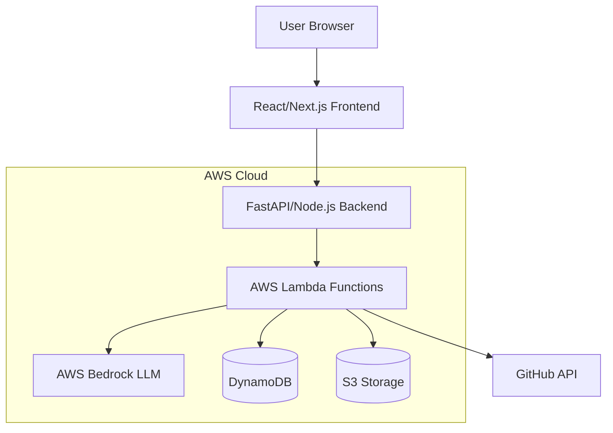
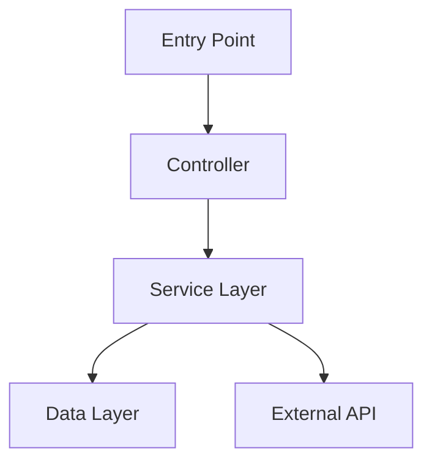

# Design Document: Legacy Lens

## Overview

Legacy Lens is a serverless, AI-powered documentation generation platform built on AWS infrastructure. The system follows a microservices architecture with clear separation between the frontend presentation layer, backend API layer, AI processing layer, and data persistence layer.

The core workflow involves:
1. User submits a GitHub repository URL through the React frontend
2. Backend API validates and queues the repository for analysis
3. AWS Lambda functions clone the repository and orchestrate AI analysis
4. AWS Bedrock (Claude 3 or Titan) analyzes code structure, generates documentation, and answers queries
5. Generated artifacts are cached in DynamoDB and presented to the user
6. Interactive features allow users to explore and query the codebase

## Architecture

### High-Level Architecture



### Component Architecture

The system is organized into the following layers:

1. **Presentation Layer**: React/Next.js frontend with code viewer, chat interface, and documentation display
2. **API Layer**: FastAPI or Node.js REST API handling authentication, request validation, and orchestration
3. **Processing Layer**: AWS Lambda functions for repository cloning, analysis orchestration, and document generation
4. **AI Layer**: AWS Bedrock integration for code analysis and natural language generation
5. **Data Layer**: DynamoDB for session/cache storage, S3 for repository clones and generated artifacts

### Technology Stack

- **Frontend**: React.js or Next.js with TypeScript
- **Backend API**: Python FastAPI or Node.js Express
- **Serverless Functions**: AWS Lambda (Python or Node.js)
- **AI/ML**: AWS Bedrock (Claude 3 Sonnet or Titan)
- **Database**: AWS DynamoDB
- **Storage**: AWS S3
- **Infrastructure**: AWS CDK or Terraform for IaC

## Components and Interfaces

### 1. Frontend Application

**Responsibilities**:
- Render user interface for repository input, documentation viewing, and chat
- Handle user interactions and state management
- Display generated documentation, flowcharts, and onboarding guides
- Provide code highlighting and selection for Why Engine

**Key Components**:
- `RepositoryInput`: Form component for GitHub URL submission
- `AnalysisProgress`: Real-time progress indicator during analysis
- `DocumentationViewer`: Tabbed interface for README, API docs, flowcharts
- `CodeExplorer`: Code viewer with syntax highlighting and selection
- `WhyEngineChat`: Chat interface for interactive code questions
- `OnboardingChecklist`: Step-by-step setup guide display

**Interfaces**:
```typescript
interface RepositorySubmission {
  url: string;
  authToken?: string;
}

interface AnalysisStatus {
  sessionId: string;
  status: 'queued' | 'cloning' | 'analyzing' | 'generating' | 'complete' | 'failed';
  progress: number;
  currentStage: string;
  error?: string;
}

interface Documentation {
  readme: string;
  apiDocs: ApiDocumentation[];
  flowchart: string; // Mermaid.js code
  onboardingGuide: OnboardingStep[];
  codeComments: CodeComment[];
}

interface WhyEngineQuery {
  sessionId: string;
  codeSnippet: string;
  filePath: string;
  lineRange: { start: number; end: number };
  question: string;
}

interface WhyEngineResponse {
  answer: string;
  references: CodeReference[];
  relatedFiles: string[];
}
```

### 2. Backend API Service

**Responsibilities**:
- Validate repository URLs and user inputs
- Authenticate users and manage sessions
- Orchestrate Lambda function invocations
- Stream analysis progress to frontend
- Serve cached documentation from DynamoDB

**Key Endpoints**:
- `POST /api/analyze`: Submit repository for analysis
- `GET /api/status/{sessionId}`: Get analysis status
- `GET /api/documentation/{sessionId}`: Retrieve generated documentation
- `POST /api/why-engine/query`: Submit Why Engine question
- `GET /api/sessions`: List user's previous analyses

**Interfaces**:
```python
class RepositoryAnalysisRequest:
    url: str
    auth_token: Optional[str]
    force_refresh: bool = False

class AnalysisResponse:
    session_id: str
    status: str
    message: str

class DocumentationResponse:
    session_id: str
    repository_url: str
    generated_at: datetime
    documentation: Documentation
```

### 3. Repository Cloner (Lambda Function)

**Responsibilities**:
- Clone GitHub repositories to temporary storage
- Validate repository accessibility
- Handle authentication for private repositories
- Extract repository metadata (languages, size, structure)

**Implementation**:
```python
def clone_repository(url: str, auth_token: Optional[str]) -> CloneResult:
    """
    Clone a GitHub repository to temporary S3 storage.
    
    Returns:
        CloneResult with s3_path, metadata, and status
    """
    # Validate URL format
    # Authenticate if private repository
    # Clone to /tmp directory
    # Upload to S3
    # Extract metadata
    # Return result
```

**Interfaces**:
```python
class CloneResult:
    s3_path: str
    repository_name: str
    languages: List[str]
    size_mb: float
    file_count: int
    directory_structure: Dict[str, Any]
```

### 4. Analysis Engine (Lambda Function)

**Responsibilities**:
- Analyze repository structure and dependencies
- Identify entry points and key components
- Map logic flow between files
- Invoke AWS Bedrock for code comprehension
- Generate structured analysis results

**Implementation**:
```python
def analyze_repository(s3_path: str) -> AnalysisResult:
    """
    Analyze repository structure and code logic.
    
    Process:
    1. Load repository from S3
    2. Parse file structure and identify languages
    3. Extract dependencies from package files
    4. Identify key functions and classes
    5. Use Bedrock to analyze code relationships
    6. Generate structured analysis
    """
    # Parse directory structure
    # Identify package manifests (package.json, requirements.txt, etc.)
    # Extract dependencies
    # Identify entry points (main.py, index.js, etc.)
    # Use AST parsing for code structure
    # Invoke Bedrock for semantic analysis
    # Return structured analysis
```

**Interfaces**:
```python
class AnalysisResult:
    repository_structure: DirectoryTree
    languages: Dict[str, float]  # language -> percentage
    dependencies: List[Dependency]
    entry_points: List[str]
    key_components: List[Component]
    logic_flow: FlowGraph
```

### 5. Documentation Generator (Lambda Function)

**Responsibilities**:
- Generate README.md with project overview
- Create API documentation from code analysis
- Generate inline code comments for complex functions
- Format documentation in markdown

**Implementation**:
```python
def generate_documentation(analysis: AnalysisResult) -> Documentation:
    """
    Generate comprehensive documentation using AWS Bedrock.
    
    Process:
    1. Generate README with project overview, setup, usage
    2. Extract API endpoints and generate API docs
    3. Identify complex functions and generate comments
    4. Format all documentation as markdown
    """
    # Prepare context for LLM
    # Generate README sections
    # Extract and document API endpoints
    # Identify complex functions (cyclomatic complexity > threshold)
    # Generate explanatory comments
    # Return structured documentation
```

**Bedrock Prompt Strategy**:
- Use structured prompts with code context
- Request specific documentation formats (markdown, JSDoc, etc.)
- Include repository metadata for context
- Use few-shot examples for consistency

### 6. Visualizer (Lambda Function)

**Responsibilities**:
- Generate Mermaid.js flowcharts showing data flow
- Identify component relationships
- Create visual representations of architecture

**Implementation**:
```python
def generate_flowchart(analysis: AnalysisResult) -> str:
    """
    Generate Mermaid.js flowchart from analysis results.
    
    Process:
    1. Identify entry points and key functions
    2. Map function call relationships
    3. Identify data flow patterns
    4. Generate Mermaid.js syntax
    """
    # Build call graph from analysis
    # Identify main execution paths
    # Generate Mermaid.js graph definition
    # Return Mermaid code
```

**Mermaid Output Format**:


### 7. Why Engine (Lambda Function)

**Responsibilities**:
- Process user questions about code blocks
- Provide context-aware explanations
- Analyze code dependencies and impact
- Maintain conversation context

**Implementation**:
```python
def process_why_query(query: WhyEngineQuery, analysis: AnalysisResult) -> WhyEngineResponse:
    """
    Process user question about code using AWS Bedrock.
    
    Process:
    1. Extract code context (file, surrounding code, dependencies)
    2. Build prompt with code context and question
    3. Invoke Bedrock for explanation
    4. Extract references and related files
    5. Return structured response
    """
    # Load code snippet and context
    # Identify dependencies and callers
    # Build comprehensive prompt
    # Invoke Bedrock with conversation history
    # Parse response and extract references
    # Return structured answer
```

**Prompt Engineering**:
- Include code snippet with file path and line numbers
- Provide surrounding context (imports, class definition, etc.)
- Include dependency information
- Maintain conversation history for follow-up questions

### 8. Onboarding Generator (Lambda Function)

**Responsibilities**:
- Generate step-by-step setup guide
- Identify required tools and dependencies
- Detect OS-specific requirements
- Create actionable checklist

**Implementation**:
```python
def generate_onboarding_guide(analysis: AnalysisResult) -> List[OnboardingStep]:
    """
    Generate onboarding checklist from repository analysis.
    
    Process:
    1. Identify required tools (Node.js, Python, Docker, etc.)
    2. Extract environment variables from config files
    3. Identify setup scripts and commands
    4. Generate step-by-step instructions
    5. Detect OS-specific requirements
    """
    # Parse package manifests for dependencies
    # Identify environment variable requirements
    # Find setup scripts (setup.py, Makefile, etc.)
    # Generate ordered steps
    # Add OS-specific instructions
    # Return structured checklist
```

**Interfaces**:
```python
class OnboardingStep:
    step_number: int
    title: str
    description: str
    commands: List[str]
    os_specific: Optional[Dict[str, List[str]]]  # OS -> commands
    verification: Optional[str]  # How to verify step completion
```

### 9. Session Manager

**Responsibilities**:
- Create and manage user sessions
- Cache analysis results in DynamoDB
- Detect repository changes and invalidate cache
- Clean up old sessions

**DynamoDB Schema**:
```python
class Session:
    session_id: str  # Partition key
    user_id: str  # Sort key
    repository_url: str
    repository_hash: str  # Git commit hash
    created_at: datetime
    last_accessed: datetime
    status: str
    analysis_result: AnalysisResult
    documentation: Documentation
    ttl: int  # Time to live for automatic cleanup
```

**Cache Strategy**:
- Cache analysis results for 30 days
- Invalidate cache if repository commit hash changes
- Use session_id for quick retrieval
- Implement TTL for automatic cleanup

## Data Models

### Repository Metadata
```python
class RepositoryMetadata:
    url: str
    name: str
    owner: str
    default_branch: str
    commit_hash: str
    languages: Dict[str, float]
    size_mb: float
    file_count: int
    last_updated: datetime
```

### Directory Tree
```python
class DirectoryNode:
    name: str
    type: 'file' | 'directory'
    path: str
    size: Optional[int]
    children: Optional[List[DirectoryNode]]
```

### Dependency
```python
class Dependency:
    name: str
    version: str
    type: 'runtime' | 'dev' | 'peer'
    source: str  # package.json, requirements.txt, etc.
```

### Component
```python
class Component:
    name: str
    type: 'class' | 'function' | 'module' | 'service'
    file_path: str
    line_range: Tuple[int, int]
    dependencies: List[str]
    complexity: int
    description: str
```

### Flow Graph
```python
class FlowGraph:
    nodes: List[FlowNode]
    edges: List[FlowEdge]

class FlowNode:
    id: str
    label: str
    type: 'entry' | 'function' | 'service' | 'data' | 'external'
    file_path: Optional[str]

class FlowEdge:
    source: str
    target: str
    label: Optional[str]
```

### API Documentation
```python
class ApiDocumentation:
    endpoint: str
    method: str
    description: str
    parameters: List[Parameter]
    request_body: Optional[Schema]
    responses: Dict[int, Response]
    examples: List[Example]

class Parameter:
    name: str
    type: str
    required: bool
    description: str

class Schema:
    type: str
    properties: Dict[str, Any]
    example: Any
```

### Code Comment
```python
class CodeComment:
    file_path: str
    line_number: int
    function_name: str
    comment: str
    complexity_score: int
```

## Correctness Properties


*A property is a characteristic or behavior that should hold true across all valid executions of a system—essentially, a formal statement about what the system should do. Properties serve as the bridge between human-readable specifications and machine-verifiable correctness guarantees.*

### Property Reflection

After analyzing all acceptance criteria, I've identified several areas where properties can be consolidated:

**Consolidation Opportunities**:
1. Properties 3.1, 4.1, and 6.1 all test that "when analysis is complete, a specific artifact is generated" - these can be combined into a single property about complete documentation generation
2. Properties 1.2 and 1.5 both test URL validation - 1.5 subsumes 1.2 since validation before cloning implies error messages for invalid URLs
3. Properties 4.4 and 4.5 both test flowchart output handling - can be combined into a single property about flowchart accessibility
4. Properties 2.1, 2.2, 2.3, and 2.4 all test different aspects of repository analysis - these are distinct and should remain separate
5. Property 7.2 (cache retrieval) is a round-trip property that subsumes 7.1 (session creation) since successful retrieval implies creation
6. Properties 8.3, 8.4, and 8.5 all test UI display capabilities after analysis - can be combined into a single property about complete UI presentation

**Properties to Keep as Separate**:
- Error handling properties (9.x) test different failure modes and should remain distinct
- Why Engine properties (5.x) test different aspects of the chat interface and should remain separate
- Onboarding properties (6.x) test different content requirements and should remain separate

### Repository Input and Validation Properties

**Property 1: URL Validation Before Processing**
*For any* repository URL input, the system should validate the URL format and accessibility before attempting to clone, returning descriptive errors for invalid URLs.
**Validates: Requirements 1.2, 1.5**

**Property 2: Valid Repository Cloning**
*For any* valid GitHub repository URL, cloning should result in the repository being stored in temporary storage with accessible file structure.
**Validates: Requirements 1.1**

### Repository Analysis Properties

**Property 3: File Structure Identification**
*For any* cloned repository, the Analysis_Engine should correctly identify and represent the complete directory structure including all files and folders.
**Validates: Requirements 2.1**

**Property 4: Programming Language Detection**
*For any* repository containing source code files, the Analysis_Engine should detect all programming languages present with their relative proportions.
**Validates: Requirements 2.2**

**Property 5: Dependency Extraction**
*For any* repository containing package manifest files (package.json, requirements.txt, pom.xml, etc.), the Analysis_Engine should extract all declared dependencies with their versions.
**Validates: Requirements 2.3**

**Property 6: Logic Flow Mapping**
*For any* repository with multiple components, the Analysis_Engine should map the relationships and call patterns between components.
**Validates: Requirements 2.4**

**Property 7: Analysis Persistence Round-Trip**
*For any* completed repository analysis, storing the results to the database and then retrieving them should produce equivalent analysis data.
**Validates: Requirements 2.5, 7.1, 7.2**

### Documentation Generation Properties

**Property 8: Complete Documentation Generation**
*For any* analyzed repository, the Documentation_Generator should produce a README.md containing project overview, setup instructions, and usage examples.
**Validates: Requirements 3.1**

**Property 9: API Documentation Completeness**
*For any* repository containing API endpoints, the generated API documentation should include all endpoints with their request/response formats.
**Validates: Requirements 3.2**

**Property 10: Complex Function Comment Generation**
*For any* repository containing functions above a complexity threshold, the Documentation_Generator should generate explanatory inline comments for those functions.
**Validates: Requirements 3.3**

**Property 11: Documentation Accessibility**
*For any* generated documentation, the system should provide both viewing and downloading capabilities for all documentation artifacts.
**Validates: Requirements 3.5**

### Visualization Properties

**Property 12: Valid Mermaid Syntax Generation**
*For any* analyzed repository, the Visualizer should generate syntactically valid Mermaid.js code that can be parsed and rendered without errors.
**Validates: Requirements 4.1, 4.4**

**Property 13: Entry Point Identification in Flowcharts**
*For any* repository with identifiable entry points (main functions, app initialization), the generated flowchart should include nodes representing those entry points.
**Validates: Requirements 4.2**

**Property 14: Component Relationship Visualization**
*For any* repository with multiple components that call each other, the generated flowchart should show edges representing those relationships.
**Validates: Requirements 4.3**

**Property 15: Flowchart Export Capability**
*For any* generated flowchart, the system should provide download options for both the Mermaid.js code and rendered image formats.
**Validates: Requirements 4.5**

### Why Engine Properties

**Property 16: Chat Interface Activation**
*For any* code block selection in the code viewer, the Why_Engine chat interface should become enabled and ready for queries.
**Validates: Requirements 5.1**

**Property 17: Context-Aware Explanations**
*For any* Why_Engine query about a code block, the response should reference the specific code context including file path, function name, and surrounding code.
**Validates: Requirements 5.2, 5.5**

**Property 18: Dependency Impact Analysis**
*For any* code block with identifiable dependencies, asking "What happens if I remove this?" should produce a response that mentions those dependencies.
**Validates: Requirements 5.3**

**Property 19: Conversation Context Maintenance**
*For any* sequence of Why_Engine queries about the same code block, later responses should reference or build upon earlier questions and answers in the conversation.
**Validates: Requirements 5.4**

### Onboarding Guide Properties

**Property 20: Step-by-Step Guide Generation**
*For any* analyzed repository, the Onboarding_Generator should produce a guide with sequentially numbered steps.
**Validates: Requirements 6.1**

**Property 21: Dependency Identification in Onboarding**
*For any* repository with package dependencies, the onboarding guide should list all required tools and dependencies for setup.
**Validates: Requirements 6.2**

**Property 22: Environment Variable Documentation**
*For any* repository using environment variables (detected in .env files, config files, or code), the onboarding guide should include steps for configuring those variables.
**Validates: Requirements 6.3**

**Property 23: Installation Command Inclusion**
*For any* repository with package dependencies, the onboarding guide should include specific commands to install dependencies and run the application.
**Validates: Requirements 6.4**

**Property 24: OS-Specific Instructions**
*For any* repository with OS-specific requirements, the onboarding guide should provide separate instructions for different operating systems.
**Validates: Requirements 6.5**

### Session and Cache Properties

**Property 25: Session Data Completeness**
*For any* created session, the stored session record should include repository URL, analysis timestamp, and all generated documentation artifacts.
**Validates: Requirements 7.4**

**Property 26: Cache Invalidation on Repository Updates**
*For any* previously analyzed repository, if the repository's commit hash changes, the system should detect the change and offer to re-analyze rather than serving stale cached data.
**Validates: Requirements 7.3**

### User Interface Properties

**Property 27: Analysis Progress Indication**
*For any* in-progress repository analysis, the UI should display a progress indicator showing the current analysis stage.
**Validates: Requirements 8.2**

**Property 28: Complete Documentation UI Presentation**
*For any* completed analysis, the UI should display navigation tabs for README, API Docs, Flowcharts, and Onboarding Guide, with syntax-highlighted code viewer and export options.
**Validates: Requirements 8.3, 8.4, 8.5**

### Error Handling Properties

**Property 29: Network Failure Retry Logic**
*For any* repository cloning operation that fails due to network issues, the system should retry up to 3 times before returning a failure to the user.
**Validates: Requirements 9.3**

**Property 30: Error Logging and User Notification**
*For any* unexpected error during processing, the system should both log detailed error information and display a user-friendly error message to the user.
**Validates: Requirements 9.5**

### Performance and Scalability Properties

**Property 31: Concurrent Request Processing**
*For any* set of multiple simultaneous repository analysis requests, the system should process them concurrently rather than sequentially.
**Validates: Requirements 10.2**

**Property 32: Incremental Result Streaming**
*For any* documentation generation process, results should be delivered to the user incrementally as they become available rather than waiting for complete generation.
**Validates: Requirements 10.4**

**Property 33: Rate Limiting Enforcement**
*For any* sequence of requests from a single user exceeding the rate limit threshold, the system should reject excess requests with appropriate rate limit error messages.
**Validates: Requirements 10.5**

## Error Handling

### Error Categories

1. **Input Validation Errors**
   - Invalid GitHub URL format
   - Inaccessible repository (404, private without auth)
   - Repository too large (>500MB)
   - Malformed authentication tokens

2. **Processing Errors**
   - Repository cloning failures (network, permissions)
   - Analysis timeouts (repository too complex)
   - LLM service failures (rate limits, service unavailable)
   - Parsing errors (unsupported file formats)

3. **System Errors**
   - DynamoDB connection failures
   - S3 storage failures
   - Lambda timeout or memory limits
   - Unexpected exceptions

### Error Handling Strategy

**Validation Errors**:
- Return 400 Bad Request with descriptive error message
- Provide suggestions for correction (e.g., "URL must start with https://github.com/")
- No retry logic (user must correct input)

**Transient Errors**:
- Implement exponential backoff retry (3 attempts)
- Log each retry attempt with context
- Return 503 Service Unavailable if all retries fail
- Suggest user retry later

**Timeout Handling**:
- Set Lambda timeout to 15 minutes
- For large repositories, offer background processing option
- Send email notification when background processing completes
- Store partial results if timeout occurs mid-analysis

**LLM Service Failures**:
- Catch AWS Bedrock throttling exceptions
- Implement request queuing for rate limit scenarios
- Fall back to cached results if available
- Provide degraded service (skip AI-generated comments, use template documentation)

**Logging Strategy**:
- Log all errors with full context (session_id, repository_url, stack trace)
- Use structured logging (JSON format) for easy querying
- Include correlation IDs for tracing requests across services
- Set up CloudWatch alarms for error rate thresholds

## Testing Strategy

### Dual Testing Approach

The testing strategy employs both unit tests and property-based tests to ensure comprehensive coverage:

**Unit Tests**: Focus on specific examples, edge cases, and integration points
- Test specific repository structures (empty repos, single-file repos, monorepos)
- Test error conditions (network failures, invalid inputs, timeouts)
- Test integration between components (API → Lambda → Bedrock)
- Test UI component rendering and interactions

**Property-Based Tests**: Verify universal properties across all inputs
- Generate random repository structures and verify analysis correctness
- Generate random code snippets and verify documentation generation
- Generate random user queries and verify Why Engine responses
- Test with minimum 100 iterations per property to ensure coverage

### Property-Based Testing Configuration

**Framework Selection**:
- **Python**: Use Hypothesis library for property-based testing
- **TypeScript/JavaScript**: Use fast-check library for property-based testing

**Test Configuration**:
- Minimum 100 iterations per property test (due to randomization)
- Each property test must reference its design document property
- Tag format: `# Feature: legacy-lens, Property {number}: {property_text}`
- Use custom generators for domain objects (repositories, code snippets, URLs)

**Example Property Test Structure**:
```python
from hypothesis import given, strategies as st

@given(st.text(min_size=1))
def test_property_1_url_validation(url):
    """
    Feature: legacy-lens, Property 1: URL Validation Before Processing
    
    For any repository URL input, the system should validate the URL 
    format and accessibility before attempting to clone.
    """
    result = validate_and_clone(url)
    
    if is_valid_github_url(url):
        assert result.success or result.error_type == "network"
    else:
        assert not result.success
        assert result.error_message is not None
        assert "invalid" in result.error_message.lower()
```

### Test Coverage Requirements

**Unit Test Coverage**:
- Minimum 80% code coverage for business logic
- 100% coverage for error handling paths
- Integration tests for all API endpoints
- UI component tests for all user interactions

**Property Test Coverage**:
- One property test per correctness property (33 total)
- Each acceptance criterion covered by either unit or property test
- Focus property tests on core business logic and data transformations

### Testing Layers

1. **Component Tests**: Test individual Lambda functions in isolation
2. **Integration Tests**: Test API → Lambda → Bedrock → DynamoDB flows
3. **End-to-End Tests**: Test complete user workflows from UI to database
4. **Property Tests**: Verify universal correctness properties across all inputs

### Mock Strategy

**External Services**:
- Mock AWS Bedrock responses for deterministic testing
- Mock GitHub API for repository cloning tests
- Use LocalStack for DynamoDB and S3 in integration tests

**Test Data**:
- Create fixture repositories with known structures
- Generate synthetic code samples for documentation tests
- Use property test generators for randomized inputs

### Performance Testing

While property 10.1 (2-minute analysis time) is difficult to test reliably in unit tests, we should:
- Monitor analysis times in production with CloudWatch metrics
- Set up alerts for analyses exceeding 3 minutes
- Conduct load testing with realistic repository sizes
- Profile Lambda functions to identify bottlenecks
